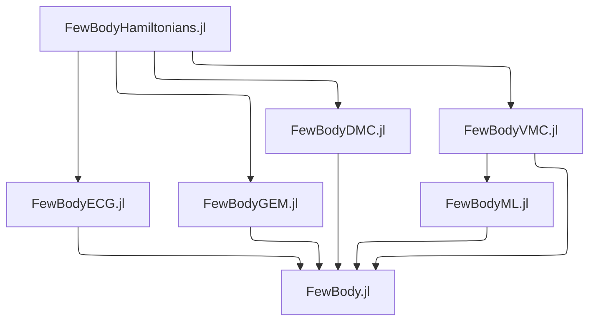

## Welcome to JuliaFewBody

This organization revolves around Julia code to solve quantum mechanical few-body problems. This is the hierarchy of packages we plan to publish:

Main developers are [Shuhei Ohno](https://github.com/ohno) and [Martin Mikkelsen](https://github.com/MartinMikkelsen). Please reach out if you have any questions, issues or suggestions.
